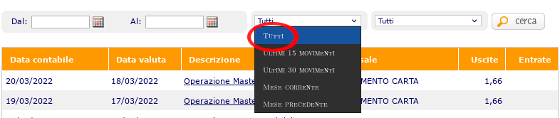

# ing.py: A tool for analysing your ING bank account

## Dependencies

In order to work properly, this programs depends only on python3 standard library.  
An optional dependence on matplotlib is required if you want to plot.  Install matplotlib by running a command like
````
$ sudo apt-get install python3-matplotlib
````

## Installation

Just clone this repository by `git clone `https://github.com/davidemanini/home_configuration.git`.  ing.py is a self-contained script.

## Usage

### Add movements to your database

 * [Log in](https://secure.ing.it/login.aspx) into your ING account.  
 * Go to "Conto corrente" > "Conto Corrente Arancio" > "Movimenti"
 * Select all available movements by selecting "Tutti" (this will let you select all the movements in the last 3 months)
   
 * Click on "Cerca" and then on "scarica foglio di calcolo".  
 * Save the file "MovimentiContoCorrenteArancio.xls" into "~/Downloads"
 * At this point you can add these movements to your database
   ````
   $ cd ~/Downloads
   $ ing.py --input MovimentiContoCorrenteArancio.xls --add-to-db
   ````
   The first time you perform this operation, you will see a message of the form
   
   ````
   Created data directory /home/davide/.ing.
   ````
 * Remember to repeat this operation at least once every 3 months.

### 